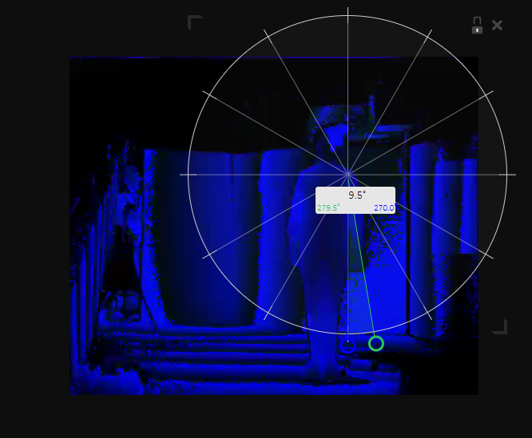

# Datascience portfolio

## Research papers

Due to starting the course in different group I initially worked on summations of research papers on ambient electromagnetic radiation.

After joining the Pepper team I started by reading, summing, and evaluating the relevance on some papers.

[Paper1](docs/sum1.pdf)

[Paper2](docs/sum2.pdf)

[Paper3](docs/sum3.pdf)

## Presentations

During this course I worked on five presentations.

[Link here](presentations)

In pptx and pdf form.

## Bullshit

### Assignment

I got a 7.0 on the Bullshit in Datascience Assignment assignment. 

[Link here to the document](docs/bullshit.pdf)

## Data gathering

### C# Kinect Application

#### Code Guidelines
The first think I did on this was build a code contribution guideline

[Link to PR](https://github.com/Hans2131/KinectingPepper/pull/4)
I made it because the experience I have with fellow students adding code willy nilly is not always positive.
This enforces peer reviews in code style and buildability. 
I also added a file for the travis build system to ensure that every merge with master would be buildable.
I later removed travis because I couldn't make it work correctly due to a lack of experience with its configuration.

#### CSV Writing
Early on I recognized the handiness of CSVs instead of xmls and other formats.

[Link to PR](https://github.com/Hans2131/KinectingPepper/pull/9/files)
I set on to make the application able to work with CSVs.
First I made it so I could load-in existing xml files and convert them to csvs. This part of the code stayed in my own branch for a while. Later on I made it also output CSVs together with the xmls when saving.
Hans later added a dialogbox so you could select a folder of XMLs to convert instead of having a hardcoded folder.

#### Usabilty
I saw that there were some mistakes going on in recording and made it so it would disable the start button when already started and disable the stop button when it already stopped. [Link here](https://github.com/Hans2131/KinectingPepper/pull/12)

## Data manipulation

### CSV Combinator
In order to work with the kinect data easily, I started working on a way to combine all generated CSV into a single CSV.
The Person's ID was in the folder name and the Exercise ID didn't exist in the data but could be gotten by taking the csv in alphabetical order. 
Link [Here](https://github.com/Blanen/csv_combinator)

### Pepper train
When we wanted to start doing real analysis we needed a way to proccess new people recordings quickly. Other people started working on this but I saw that this was going to go wrong. The problem was that they each had their own Jupyter notebooks for their part of the analysis. What ended up happening was that person-A's code was getting called inside person-B's functions. The problem with this is that person-B's code is now dependant on Person-A's code, while there is no real way of doing version control.

With Boris I designed the process on how a 'train' could be made to work. This combines many steps of data manipulation to raw kinect data. I build this into a python command line application [Here](https://github.com/KinectingPepper/pepper_train)

#### Packagize other code

I made the other people's jupyter files into Python packages that should be easily installable with pip.

[Pepper_arcs](https://github.com/KinectingPepper/pepper_arcs)

[Data_extraction](https://github.com/KinectingPepper/Data_Extraction)

Sadly, due to serverside user-rights and usability issues concerning people's inexperience with working outside jupyter, these are not able to be used at the moment in jupyter, and the writers haven't updated them. 

These are currently in working condition last time I tested them.

#### Managing environments with conda

Created a document to explain how to create and use a conda environment in anticipation of usage of the command line application.

[Link](managen_env.pdf)

#### BACK TO JUPYTER

Later on, the command-line-application was partly re-ported back to a Jupyter notebook by Hans due to not easily being able to run it in a notebook because it's uninstallable in the default environment that Jupyterhub used.

This ended up in a non-working state. This was partly due to an issue in the C# program( and a weird decission by Microsoft to make it this way) where whether a decimal-character is ',' or a '.' depended on the environment the software was being run in.

Due to the data_extraction package not being in an ideal state, it was really hard to debug this and other issues. It still gives errors that I cannot explain.

#### Future work

I supplied a document to the pepper_train part on how I recommend to continue building on this code. [Link](pepper_train_recommendations.md)

### Validation

I participated in the validation of our angle-calculation code. 

I found a tool to use called protractor to manually record the angles of images.

I generated the frames from the videos with ffmpeg.

I manually got the angles from person 2 and 4. In the end, my extraction of angles of person 2 was done wrong and was redone.

## White Paper

I made some contributions to the whitepaper according to [The planning](docs/planning.pdf)

## Assignments

### Datacamp

Screenshot: [Link](images/datacamp.png)

### Coursera

Screenshot: [Link](images/coursera.png)

### PySpark

Completed all assignments... In a more correct way than the supplied answers. (It didn't add up the count in the babynames-counties)

[Link](tutorial_spark/)

### Exploratory Data Analysis

Completed all assignments.

[Link](ExploratoryDataAnalysis/)

## Machine learning

### Clustering

#### On pepper data

I did a clustering analysis on the age vs maximum-angle-of-painful-joint angle [Here](notebooks/clustering.ipynb)

#### On the images supplied by Jan-Dirk

I did some color-quantization of an image by k-means clustering with the purpose of finding a palette or a dominant color. 

[Here](notebooks/quantize.ipynb)

What you can see in the results is a list of tuples. This tuple get a count of how many pixels are in the following cluster_centroid. 
This way we can get a palette and/ or a dominant color from the image. The first results are not really interesting colors (black-ish/white-ish) but then you get a couple more interesting ones. 

K-means is actually not the best way to do this, but it's the best current way in python.

## Experimentation

### Alternative angle calculation

At some point in this course I got an idea on how to calculate the angles in an alternative way. My way didn't require the expensive rotation to be done on the body first but could be done on any raw frame data, saving calculation time. 

[Link](notebooks/different_arc_calc.ipynb)

I never ended up finishing it or my idea was just simply wrong. You can see in the results that, yes, you can recognize the start and end of a movement but the angle's values are completely wrong.

### Alternative exercise cutting

Due to the previous mentioned state of the data_extraction library Boris and I set on to device an alternative way of identifying the start and end of a movement.

We started with trying to smooth out the signal by various means. 

Then we take the derivate in order so the start and ends of the movement should peak in the positive and negative respectively. I did get a promising result in the end but due to time constraints I couldn't continue with this work.

[Link here](notebooks/started_filtering.ipynb)
